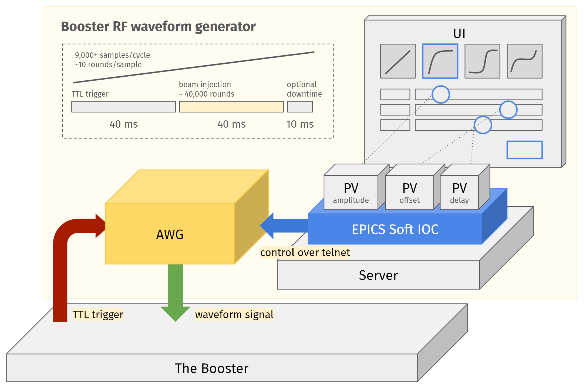
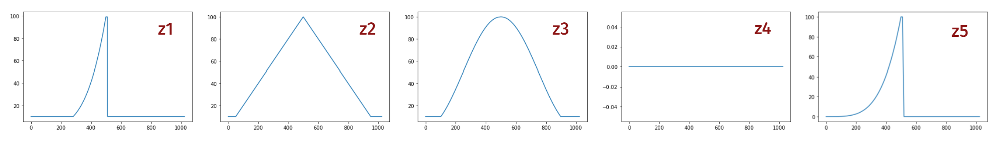
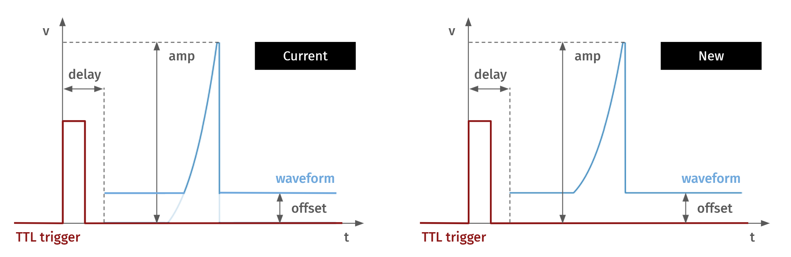
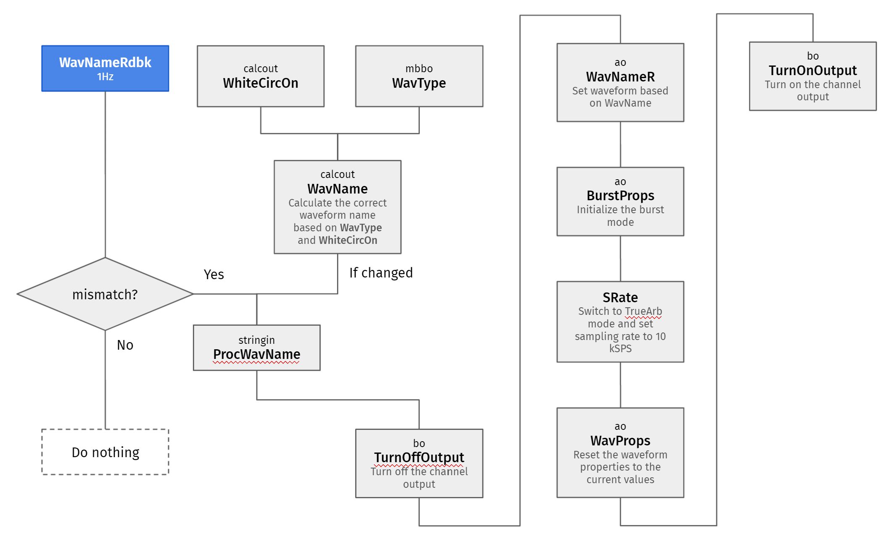
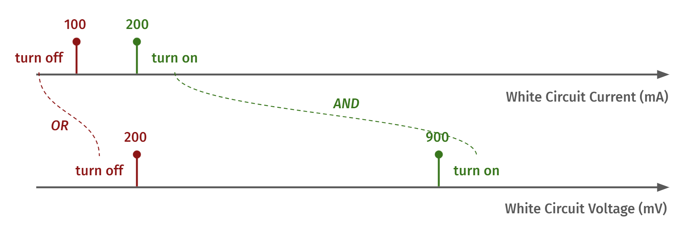
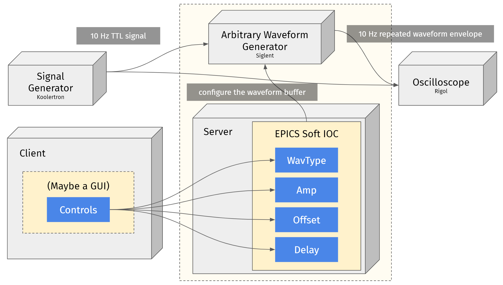
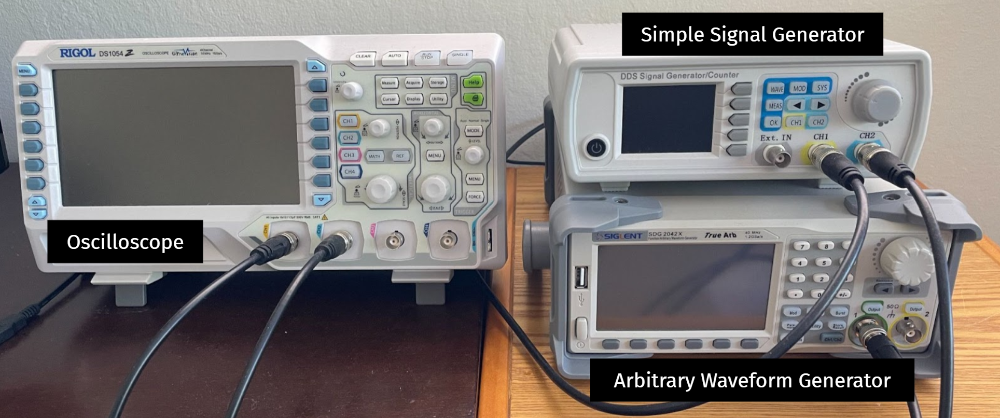

# Booster RF Waveform Generator

## Overview

The current booster RF waveform generator (WFG) used in SPEAR3 is based on CAMAC. It's still working, but the hardware is outdated and should be retired soon, while the GUI should also be replaced with a modern one which would have more support in the upcoming years. It would be better to use EPICS as the underlying framework to make it more consistent with other components in the control system.

That's why we are seeking an alternative approach to replace the current booster RF WFG. This project mainly explores and serves as a proof of concept of the following technique stack:

- Commercial aribitrary waveform generator (AWG) to generate the waveform
- EPICS as the underlying framework to drive the communication between the clients (users) and the AWG



Above is a system schematic plot that renders the usage of the AWG and the corresponding EPIC soft IOC in the system.

## System specifications

### Hardware (AWG)

#### Features specs

To be able to generate/output the current waveform buffers, and comply with the current SPEAR3 control system and the newly developed EPICS soft IOC, the AWG has to support:

- Length of waveform buffer: 1024
- Sampling rate: 10k Sa/s
- Output value range: 0 V to 10 V
- Vertical resolution: 16-bit
- Support external trigger
- Support interfaces: LAN (telnet)

#### API specs

To work with the EPICS soft IOC without significant workflow modifications, the AWG needs to support the following APIs (control commands):

- Turn on/off the output
- Upload/download a predefined waveform buffer
- Get/set the current output waveform through name/id
- Get/set the waveform properties
    - Amplitude
    - Offset
    - Phase
- Get/set the burst mode properties
    - Gated/Ncycle
    - Ext/Int trigger
    - Pos/Neg polarity
- Get/set the sampling rate
    - Get/set frequency is also OK

## Working principle

First upload the following 5 predefined waveform buffers (`z1` to `z5`) to the AWG:



The meanings of the 5 waveforms:

- `z1`: $t^4$, current waveform 1
- `z2`: Linear, current waveform 2
- `z3`: Since, current waveform 3
- `z4`: Edot, current waveform 4 when white circuit is off
- `z5`: $E^4$, current waveform 4 when white circuit is on

Whenever the waveform type is changed, the following actions happen:

- Load the corresponding predefined waveform buffer stored in the AWG
- Configure the other AWG properties *if needed*
    - Sampling rate
    - Burst mode properties
    - Waveform properties

Whenever the waveform properties are changed, the following actions happen:

- Set the amplitude/offset/phase properties of the AWG
    - Need to map the AWG properties correctly to the WFG properties. The definitions of the WFG properties is shown in the right plot in the [waveform rescaling mechanism](#waveform-rescaling-mechanism) section

## PV list

### PVs in the current booster waveform generator

PV | Description | Channel
-- | ----------- | -------
inj:BOO_RF$POWER_AS | Waveform setpoint |
inj:BOO_RF$POWER_MIN_AS | Waveform offset |
inj:BOO_RF$POWER_MAX_AS | Waveform amplitude |
inj:BOO_RF$PHASE_AS | Waveform delay |
inj:BOO_RF$WAVEFORM_DS | Type of waveform |

### PV correspondence between the current system and the new system

PV in the current system | PV in the new system | Description
------------------------ | -------------------- | -----------
inj:BOO_RF$POWER_AS | BOO-RF-WFG:Waveform | Waveform setpoint
inj:BOO_RF$POWER_MIN_AS | BOO-RF-WFG:Offset | Waveform offset
inj:BOO_RF$POWER_MAX_AS | BOO-RF-WFG:Amp | Waveform amplitude
inj:BOO_RF$PHASE_AS | BOO-RF-WFG:Delay | Waveform delay
inj:BOO_RF$WAVEFORM_DS | BOO-RF-WFG:WavType | Type of waveform

### PVs watched by the BOO-RF-WFG soft IOC

PV | Description | Channel
-- | ----------- | -------
inj:BOO_DC$CURR_AM | White circuit current
inj:BOO_AC$VOLT_AM | White circuit voltage

### Main tunable PVs in the BOO-RF-WFG soft IOC

PV | Description | Unit | Channel
-- | ----------- | ---- | -------
BOO-RF-WFG:Output | Toggle the channel output. 0: turn off the channel output; 1: turn on the channel output |  |
BOO-RF-WFG:WavType | Set the waveform type. Valid values are 1, 2, 3, and 4. 1: t^4 waveform; 2: linear waveform; 3: sine wave waveform; 4: Edot and E^4 dependent wave waveform |  |
BOO-RF-WFG:Amp | Set the upper bound of the waveform buffer. Waveform buffer will be re-scaled to reach this upper bound | V |
BOO-RF-WFG:Offset | Set the lower bound of the waveform buffer. Waveform buffer will be re-scaled to reach this lower bound. Note that the lower bound must be no less than 10 mV | V |
BOO-RF-WFG:Delay | Set the delay of the waveform buffer in ms. Since the waveform repetition period is always 100 ms, 50 ms delay means a 180 deg forward phase shift | ms |
BOO-RF-WFG:Waveform | Update current waveform buffer. The waveform buffer specified by this PV will replace the one with the name $(device):WavName that stored in the AWG. ALERT: one should NOT use this PV directly to update the waveform buffer! |  |

### Constants

PV | Description | Unit | Channel
-- | ----------- | ---- | -------
TTL:PRF | TTL pulse repetition frequency (10 Hz). Should NOT be changed | Hz |

### White circuit related PVs in the BOO-RF-WFG soft IOC
PV | Description | Unit | Channel
-- | ----------- | ---- | -------
BOO-RF-WFG:WhiteCircCurrOn | Minimum white circuit current to turn RF on. Default value: 200 mA | mA |
BOO-RF-WFG:WhiteCircCurrOff | Minimum white circuit current to keep RF on. Default value: 100 mA | mA |
BOO-RF-WFG:WhiteCircVoltOn | Minimum white circuit voltage to turn RF on. Default value: 900 mV | mV |
BOO-RF-WFG:WhiteCircVoltOff | Minimum white circuit voltage to keep RF on. Default value: 200 mV | mV |
BOO-RF-WFG:WhiteCircOn | Calculate the on/off status of the white circuit based on the relationship between the white circuit current/voltage and the 4 white circuit threshold PVs defined above. 0: white circuit is off; 1: white circuit is on |  |

### Readback PVs in the BOO-RF-WFG soft IOC

PV | Description | Unit | Channel
-- | ----------- | ---- | -------
BOO-RF-WFG:OutputRdbk | Channel output status monitor |  |
BOO-RF-WFG:AmpRRdbk | AWG amplitude readback. Note that the amplitude of AWG (AmpR) is different from the main tunable PV amplitude (Amp). The relationship is: AmpR = Amp - Offset | V |
BOO-RF-WFG:OffsetRRdbk | AWG offset readback. Note that the offset of AWG (OffsetR) is different from the main tunable PV offset (Offset). The relationship is: OffsetR = (Amp + Offset) / 2 | V |
BOO-RF-WFG:PhaseRRdbk | AWG phase readback. Note that the phase of AWG (PhaseR) is different from the main tunable PV delay (Delay). The relationship is: PhaseR = -3.6 * Delay | deg |
BOO-RF-WFG:SRateRdbk | AWG sampling rate readback. Should always be 10,000 Sa/s | Sa/s |
BOO-RF-WFG:WaveformRdbk | AWG current waveform buffer readback. Note that the readback points are the raw data, need to use Amp, Offset and Delay to transform it to the real output waveform buffer |  |

### Internal PVs in the BOO-RF-WFG soft IOC

PV | Description | Unit | Channel
-- | ----------- | ---- | -------
BOO-RF-WFG:WavName | Id of the current AWG waveform file. It's determined by WavType and WhiteCircOn |  |
BOO-RF-WFG:WavNameRdbk | The heart-beat of this soft ioc. It checks the current active waveform name every second. Once it detects that the current active waveform name is not among the predifined 5 waveforms, it will trigger a sequence of actions to re-configure the AWG |  |
BOO-RF-WFG:ProcWavName | A mismatch in WavNameRdbk will trigger this PV to process. The only thing it does is to trigger the turns-off-output PV to process |  |
BOO-RF-WFG:TurnOffOutput | Turn off the channel output then trigger the setting waveform PV |  |
BOO-RF-WFG:WavNameR | Set the output waveform buffer of the AWG then trigger the setting burst properties PV |  |
BOO-RF-WFG:WaitNBurstProps | Add a delay between the waveform set-up and the burst props set-up, to prevent strange AWG behavior |  |
BOO-RF-WFG:BurstProps | Set the burst mode props. The waveform output would be gated and triggered by the external signal, then trigger the setting sampling rate PV |  |
BOO-RF-WFG:SRate | Set the True Arb mode and the sampling rate. Sampling rate is always 10,000 Sa/s. Then trigger the setting waveform properties PV |  |
BOO-RF-WFG:WavProps | Set the waveform properties. Including amplitude, offset and phase. Then trigger the turn-on-output PV |  |
BOO-RF-WFG:WaitNTurnOnOutput | Add a 0.5s delay between waveform props set-up and turning on the output to prevent strange behavior |  |
BOO-RF-WFG:TurnOnOutput | Turn on the channel output. Then trigger the waveform readback PV to process |  |
BOO-RF-WFG:AmpR | Set the AWG amplitude based on Amp and Offset. Trigger the AWG offset set-up PV to process |  |
BOO-RF-WFG:OffsetR | Set the AWG offset based on Amp and offset |  |
BOO-RF-WFG:PhaseR | Set the AWG phase based on Delay |  |
BOO-RF-WFG:BSWV | Scan the AWG waveform properties every 5s and update the corresponding readback PVs |  |
BOO-RF-WFG:Idn | Scan the AWG instrument id every 5s |  |

### PVs in the BOO-WC soft IOC

PV | Description | Unit | Channel
-- | ----------- | ---- | -------
BOO-WC:Curr | Mock-up white circuit DC current | mA |
BOO-WC:Volt | Mock-up white circuit AC voltage | mV |

### PV correspondence between the white circuit system and the mock-up system

PV in the white circuit system | PV in the mock-up system | Description
------------------------------ | ------------------------ | -----------
inj:BOO_DC$CURR_AM | BOO-WC:Curr | White circuit current
inj:BOO_AC$VOLT_AM | BOO-WC:Volt | White circuit voltage

## Caveats

### Waveform rescaling mechanism



To comply with the minimal output value (10 mV) requirement, the lower bound of the waveform offset is set to 0.01 V.

### Power outage recovery logic



### White circuit status change logic



### Upload new/replace old waveform buffers to the AWG

**WIP**

## Local test configuration

### Prerequisites 

To set up a local test, the following components are needed:

- The AWG
- A computer that host the EPICS soft IOCs
- A simple signal generator
    - At least 2 channels are needed
- An oscilloscope
- BNC cable x 3
- Ethernet cable x 1
- A working local area network (LAN)

Below is the local test schematic plot. 



### Software configurations

Clone the WFG soft IOC and the white circuit mock-up soft IOC repos (please check [this section](#additional-resources)) to the computer. Follow the instructions in the readme of the WFG soft IOC repo and configure the EPICS environment on the computer, then compile and run the two soft IOCs. 

### Hardware configurations



## Known issues

- The waveform buffer isn’t locked to the TTL trigger sometimes
    - Switch WavType back and forth could resolve this
    - Or limit the waveform buffer length to 1000
- The waveform switching time could vary between subsecond to several seconds
    - Need to find the root cause of this
- The shape of the waveform buffer could be not exactly the same as the current one due to the [rescaling mechanism](#waveform-rescaling-mechanism)
- The output is not automatically turned on after a power outage recovery
    - This could be a feature depends on the needs
    - If not desired, simply turn off the AWG auto-recovery feature

## Additional resources

### Repos for the WFG EPICS soft IOC

- SPEAR3-CTRL: [https://github.com/SPEAR3-CTRL/ioc-awg](https://github.com/SPEAR3-CTRL/ioc-awg) *or*
- SLAC Hub: [https://github.com/slaclab/spear3-ioc-awg](https://github.com/slaclab/spear3-ioc-awg)

### Repos for the white circuit mock-up EPICS soft IOC (for local test)

- SPEAR3-CTRL: [https://github.com/SPEAR3-CTRL/ioc-whitecircuit-mockup](https://github.com/SPEAR3-CTRL/ioc-whitecircuit-mockup) *or*
- SLAC Hub: [https://github.com/slaclab/spear3-ioc-whitecircuit-mockup](https://github.com/slaclab/spear3-ioc-whitecircuit-mockup)

## Development notes

### The AWG soft IOC

#### Initialize an empty soft IOC

```bash
mkdir ioc-awg
cd ioc-awg
```

```bash
makeBaseApp.pl -t ioc awg
makeBaseApp.pl -i -t ioc awg
```

Then we have the following folder structure:

```
|--ioc-awg
    |--awgApp
    |--configure
    |--iocBoot
    |--Makefile
```

Compile the project:

```bash
make
```

After this, several new folders are created:

```
|--ioc-awg
    |--awgApp
    |--*bin
    |--configure
    |--*dbd
    |--iocBoot
    |--*lib
    |--Makefile
```

```bash
cd iocBoot/iocawg
chmod u+x st.cmd
```

```bash
./st.cmd
```

#### Add the AWG records

Assume we are at the project root, then we add a database file:

```bash
cd awgApp/Db
```

Create an `awg.db` file there, fill in whatever record you want. Say:

```
record(calc, "$(user):awg:random") {
    field(DESC, "Just a random number")
    field(SCAN, "1 second")
    field(INPA, "10")
    field(CALC, "RNDM*A")
}
```

Configure the `Makefile` to include it in the compiling process:

```makefile
#----------------------------------------------------
# Create and install (or just install) into <top>/db
# databases, templates, substitutions like this
DB += awg.db
```

Then configure the start up script `st.cmd`:

```makefile
## Load record instances
dbLoadRecords("db/awg.db","user=wena")
```

Run it:

```bash
cd iocBoot/iocawg
./st.cmd
```

Test it:

Open another terminal within the same network, try:

```bash
caget wena:awg:random
```

or

```bash
camonitor wena:awg:random
```

#### Add the asyn and stream packages

Now we are going to talk with the AWG. Make a new record inside the `awg.db` and create a new `awg.proto`:

Then configure the project to add the asyn and stream modules, edit:

```bash
vi configure/RELEASE
```

And add:

```makefile
# Variables and paths to dependent modules:
#MODULES = /path/to/modules
#MYMODULE = $(MODULES)/my-module
SUPPORT = ${HOME}/EPICS/support
ASYN = $(SUPPORT)/asyn
STREAM = $(SUPPORT)/stream
```

Then edit the `Makefile` in the src folder and include the corresponding records provided by asyn and stream modules, so that we can use them in `st.cmd` and our C scripts:

```bash
vi awgApp/src/Makefile
```

Edit it like this:

```makefile
# Include dbd files from all support applications:
awg_DBD += asyn.dbd
awg_DBD += stream.dbd
awg_DBD += drvAsynIPPort.dbd

# Add all the support libraries needed by this IOC
awg_LIBS += asyn
awg_LIBS += stream
```

Now tell the softioc where to find the `.proto` files:

```bash
vi iocBoot/iocawg/st.cmd
```

Edit it like this:

```makefile
< envPaths
epicsEnvSet("STREAM_PROTOCOL_PATH", "${TOP}/awgApp/Db")
```

Finally in the same file, configure the telnet stuff, so that the softioc can talk to the correct instrument:

```makefile
## Register all support components
dbLoadDatabase "dbd/awg.dbd"
awg_registerRecordDeviceDriver pdbbase
drvAsynIPPortConfigure("AWG", "10.0.0.10:5024")
```

Make and run, see if things work.

Note that to retrieve the full string, you have to do this:

```bash
caget -S wena:awg:idn.VAL$
```

instead of:

```bash
caget wena:awg:idn
```

https://epics.anl.gov/tech-talk/2019/msg01850.php

If you are using fish shell, remember to escape `$`:

```bash
caget -S wena:awg:idn.VAL\$
```

### AWG message format

##### BSWV

```
C1:BSWV WVTP,ARB,FRQ,40.6504065HZ,PERI,0.0246S,AMP,10.6671V,MAX_OUTPUT_AMP,20V,OFST,3.95e-05V,HLEV,5.3336V,LLEV,-5.33352V,PHSE,0
```

##### SRATE

```
C1:SRATE MODE,TARB,VALUE,10000Sa/s
```

##### WVDT

```
C1:WVDT WVTP,ARB,FRQ,40.6504065HZ,PERI,0.0246S,AMP,10.6671V,MAX_OUTPUT_AMP,20V,OFST,3.95e-05V,HLEV,5.3336V,LLEV,-5.33352V,PHSE,0
```

### Misc

#### Understand the EPICS soft IOC file structure

- root: {TOP}
    - db: define/save all records
    - dbd: ?
    - iocBoot
        - {project name}: {IOC}
            - st.cmd: the startup commands
    - bin: created after compiling
        - {platform}
            - {compiled executable}: the one that execute the startup commands

#### Workflow to create a soft IOC

1. Make a dir and cd into it
2. Use makeBaseApp.pl to create an ioc project, give it a name, say, BERSERK
    - The folder BERSERKApp will be created, this is the src folder for our softioc
3. Create the records inside the src folder: db file inside the BERSERKApp/Db
4. Modify the Makefile inside the src folder to include the db/stuff
5. Go to iocBoot/iocBERSERK, adapt the st.cmd to the status
    - st === start up
6. Remember to set the system environment, then cd to the root folder of this project, then make
    - db, dbd, bin, lib will be created
7. Start the softioc: cd to the st.cmd dir, then call the executable upon it

#### How to deal with multiple network interface issue on windows

In the client terminal, do the following:

```cmd
SET "EPICS_CA_AUTO_ADDR_LIST=NO"
SET "EPICS_CA_ADDR_LIST=10.0.0.172"
```

Or set them in the system env.

However, the solution above can't deal with multiple IOCs on the same host, in that case, use the following settings:

```cmd
SET "EPICS_CA_AUTO_ADDR_LIST=NO"
SET "EPICS_CA_ADDR_LIST=10.0.0.255"
```

which uses the broadcast address instead of the IP address of the host.
